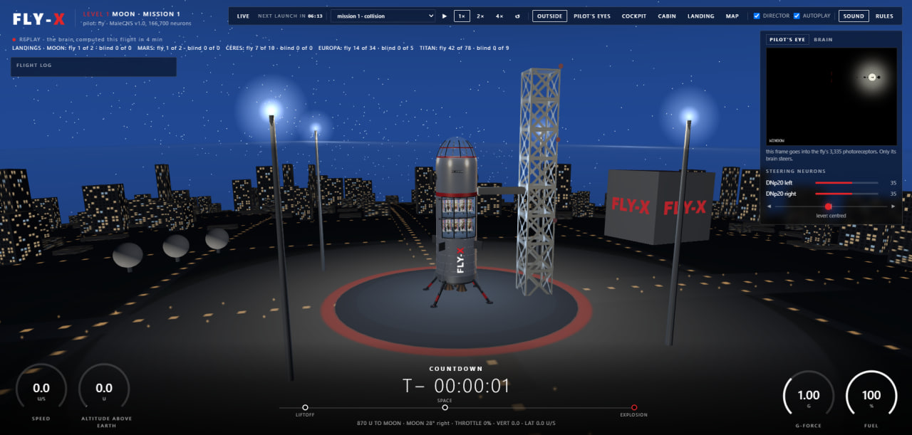
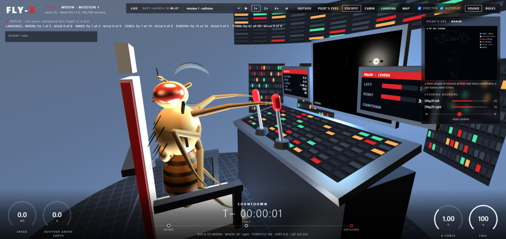
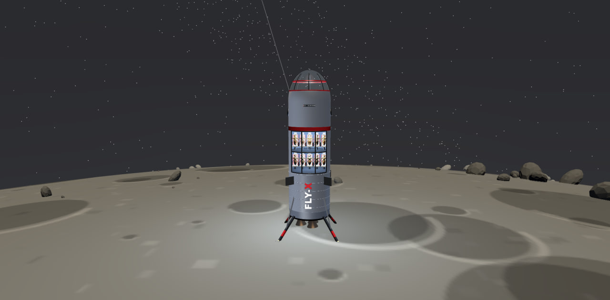

# FLY-X

A real fly brain flies the rocket.

A model of a fruit fly's brain (the MaleCNS v1.0 connectome, **166,700 neurons and
25,582,938 synapses**) flies a rocket from Earth to the Moon, Mars, Ceres, Europa
and Titan. Nobody tells the fly where the target is. It is shown the picture in
the window, and it turns toward the brighter side, because flies steer toward
light. Everything else follows from that.

A control fly flies alongside, always: same brain, same world, same computation,
but the window is painted over. It never lands.



---

## What is in this repository

| path | what it is |
|---|---|
| `sim/world.py` | the rules of the world: levels, gravity, air, rocks, meteors, the pad, and **the drawing of the very window** the fly sees |
| `sim/mission.py` | the flight itself: the brain step, the lever, the phases, collisions, the leg sensors |
| `sim/runner.py` | the broadcast: one flight after another, the campaign, the slot schedule |
| `sim/holders.py` | the passengers: the token's top ten holders, read from the chain |
| `sim/flightlog.py` | the onboard log, written **only** from telemetry |
| `sim/export.py`, `sim/analyze.py` | bundles for the site, and the tally of outcomes |
| `web/` | the viewer: three.js, the rocket, the cameras, the gauges, the sound |

The finished flights are committed on purpose: open the page and you see exactly
the flights the numbers below describe, and any one of them can be recomputed on
your machine and compared.

---

## The brain

### The model

Leaky integrate-and-fire: every neuron has a membrane potential, it accumulates
incoming spikes, leaks over time, and on reaching threshold fires a spike of its
own and resets. This is not membrane biophysics and not Hodgkin-Huxley, it is the
level of abstraction that keeps what matters here: **who is connected to whom,
with what weight and with what sign**.

A native C++ kernel does the arithmetic. Before a run the binary is checked
against its own source by hash, so that what runs is what is written.

One brain step = 1000/35 ≈ 28.6 ms of neural time. The physics inside a step is
divided into four substeps further.

**The whole brain is computed.** Every step updates all 166,700 neurons and all
25,582,938 connections. There is no sample, no trimmed subnetwork, no "important
regions".

### What the brain does and does not do

The synaptic weights come from the reconstruction and never change: not between
flights, not within one. The brain does not learn and does not remember previous
flights; each one starts from the same state. It does not know it is in a rocket,
and it does not know the words "Titan", "fuel" or "landing". It responds to light.

### Where the wiring comes from

The wiring is the public **male-CNS v1.0** release of the FlyEM project, a
reconstruction of the central nervous system of a male fruit fly from electron
microscopy. Three files are downloaded, each pinned by size and checksum:

| file | what is inside | size |
|---|---|---|
| `body-annotations…feather` | each neuron's type, class and side | 14,483,314 B |
| `body-neurotransmitters…feather` | which transmitter a neuron releases, hence the sign of its connections | 43,282,834 B |
| `connectome-weights…feather` | who connects to whom, and with how many synapses | 1,051,241,946 B |

The graph built from them is 250 MB, which is why it is not in this repository:
GitHub does not accept files above 100 MB.

### How to build the same brain

1. Clone the DOOMFLY engine at commit `71ecf53d78eaffaf1a57ed7b0ccf5d458abc9f33`.
2. Run its connectome build: the three files above are fetched from their pinned
   URLs and become `outputs/doom/malecns_v1/graph.npz`.
3. Check the sums:

   ```
   graph.npz    250,157,214 bytes   sha256 dfc765c999404463110a6e993348fb77d5db559d9e0e6f4fee16932a516bc296
   kernel.cpp         2,793 bytes   sha256 f755334c260758eaece63d3ab78e6496b2db60942a0a89a196e9f02a047e3586
   ```

4. Point `FLY_BRAIN_ROOT` at the built brain.

If the sums match, you have the same brain to the byte as the one flying here,
and any flight can be recomputed and compared against ours.

---

## The eye

The window is rendered as a **640×480 frame with a 90° field of view**. In it:
stars, Earth behind, the target as a bright patch, dark rocks, and meteors that
fade with the inverse square of distance.

From that frame **3,335 samples** are taken at the positions of the fly's
photoreceptors (bilinear interpolation of luminance, in linear light, with sRGB
decoded properly). Nothing else reaches the eyes: no coordinates, no distance,
no heading.

### Light adaptation

Real fly photoreceptors turn their own gain down in bright light. The LIF retina
has no such mechanism, and when the target grows until it floods the window, both
eyes wash out equally, the left-right contrast disappears, and there is nothing
left to steer by. So the eye's gain follows one rule:

```
gain → ADAPT_LUM / mean luminance across receptors,   never above 1
ADAPT_LUM = 0.06,  time constant 0.3 s
```

It can only dim, so a dark sky is untouched and the zero calibration still holds.
The rule is the same in every mode, the blind one included.

---

## The lever: the only channel of control



The fly has a pair of large descending neurons, **DNp20**, left and right; in a
real fly they take part in turning the body. The reading is taken like this:

```
signal = (right DNp20 rate - left DNp20 rate) - a fixed bias
```

**The bias is measured once and published.** The fly is put in front of an empty
starry sky with no target, and the difference is watched for four seconds. It came
out at **12.0 Hz**: in this reconstruction the right side simply fires more than
the left, and without subtracting it the rocket would forever drift right. The
result is in `runs/bias.json` and is reproduced by `mission.py --calibrate`.

The signal is then smoothed with a one-second time constant, otherwise the lever
twitches on every spike, and turned into a lever position: **full deflection at
6 Hz** from zero.

What the lever does:

* **on the way up** it turns the rocket, up to 40° per second at full deflection;
* **on the landing** it sets sideways speed: wherever the fly leans, the rocket
  moves over the surface.

The lever works on one axis, left and right. A second axis would need a second
independent neural readout, and inventing one would mean faking the proof.

---

## Who controls what

**The fly decides where the rocket goes.** That is the only question this flight
actually has to answer: nothing marks the target except light in the window, and
no part of the program knows where it is. Heading on the way up and drift on the
landing are the fly's, and a miss or a hit is entirely its own.

**The computer decides how the rocket flies.** Throttle, the flip to
engines-first, braking, descent rate, the landing camera, cutting the engine on
the legs' signal, and the limit on sideways speed near the ground. Exactly what a
real booster's computer does: it can keep a rocket intact, but it cannot aim one.
It reads only its own altitude and speed, and **its formulas contain no position
of the target or the pad**.

**The world does not help.** Gravity, air, fuel, rocks, meteors, the pad and the
terrain are fixed per level. The mission number only chooses the arrangement.
Nothing in the world reacts to how the pilot is doing.

---

## How a flight goes

**Launch.** A second on the pad, so the fly can look at the sky and catch the
target, then the engine.

**Climb.** Full thrust, and the rocket goes where its nose points. The air is
dense near the ground and thins with height (scale height 12 units), so the first
seconds are slow. While the engine burns, the computer holds the velocity along
the hull's axis. That is an arcade simplification rather than orbital mechanics:
it makes the course a matter of where the fly points, not of a gravity turn.

**Out of the dense air.** Recorded in the log as an event.

**The flip.** The computer works out how long a 180° turn takes plus the braking
distance at its planned 12 u/s². As soon as less than that remains to the surface,
the engine cuts and the rocket turns engines-first over two seconds, exactly the
way a Falcon lands. During the flip it is ballistic, with no thrust.

**The landing burn.** Now the picture changes: the fly no longer looks forward out
of the nose but **downward, through the landing camera**, and sees the surface and
the bright pad. The computer holds the descent rate to a profile (the lower, the
slower, aiming at 1.5 u/s at contact), and the fly's lever sets the sideways move.

**The last metres.** Below 20 units the computer scales the sideways speed down
with height, to 15% of maximum right at the ground. This was added after the fly's
first four landings all tipped over the same way: the pad's angular size in the
camera grows as 1/height, so at low altitude every small correction turned into a
swing. Real landers fly the last stretch nearly vertically for the same reason.
**The direction stays the fly's**, only the magnitude is limited.

**Contact.** Three numbers decide it: vertical speed, sideways speed, and the
slope under the legs. More than 6 u/s down and the legs fail. A slope above 12°
or sideways speed above 2 u/s and the rocket goes over. Otherwise it stands;
inside a circle of radius 3 units that is a landing on the pad, outside it a
landing off it.



---

## The legs feel the ground

At contact the legs do not merely stop the rocket. Their sensors drive **2,522 leg
mechanosensory neurons** of the real fly, the ones entering the central nervous
system through the leg nerves: MetaLN 1102, MesoLN 1089, ProLN 331. The stimulus
takes the same path the original engine uses to feed the fly sugar.

**And the brain lights up.** You can see it on the BRAIN tab: a handful of cells
glow through the whole landing, and at the moment of contact almost the entire
field comes on at once. Numbers from a real flight (Titan, mission 69):

| moment | active cells per recorded row |
|---|---|
| landing burn | 11.7 |
| contact, legs on the ground | **73.0** |
| standing on the legs | 79.4 |

More than a sixfold jump. The leg neurons fired 154,095 spikes where in the same
half second before contact there were none; the ascending neurons, which carry
the body's signal up into the brain, 15,948 against zero. The strongest responses
came from cells of types PEN_a and PEN_b, the central complex, where a fly keeps
its sense of heading.

The response is measured against the background and **without the optic lobes and
sensory cells**, otherwise we would be measuring a reaction to the picture rather
than to the touch.

---

## The claim, and how it is tested

**The claim:** the direction of flight is set by the fly's visual system, and by
nothing else.

One flight cannot test that, a lucky landing is possible. So three pilots fly in
the broadcast continuously, and their results are counted separately.

| pilot | what it is | what it is for |
|---|---|---|
| **the fly** | the full connectome, window open | the case itself |
| **the blind fly** | same brain, same world, window painted black | same computation, same noise, only the picture is missing |
| **the oracle** | a perfect pilot that knows where the target is | the upper bound: how passable the world is at all |

The blind fly is not "a fly without a brain". It is the same brain, stepping the
same 166,700 neurons, and the difference is exactly one thing: the brightness of
the pixels arriving at the photoreceptors.

### Results under the current rules

69 broadcast flights, as of 13 September 2026:

| level | pilot | flights | landed | what happened |
|---|---|---|---|---|
| 1 Moon | fly | 2 | 1 | 1 collision |
| 2 Mars | fly | 2 | 1 | 1 tipped over |
| 3 Ceres | fly | 5 | 4 | 1 collision |
| 4 Europa | fly | 11 | 3 | 5 tipped over, 3 collisions |
| 5 Titan | fly | 43 | 30 (3 on the pad) | 7 tipped over, 6 collisions |
| **4-5** | **blind** | **6** | **0** | **all six fell back to Earth** |

The seeing fly: **39 landings out of 63**. The blind one: **0 out of 6**, and all
six the same way, never leaving Earth.

### The second piece of evidence: brain activity

Every flight records which neurons fired. The whole brain is computed, while what
is recorded is a fixed sample of 612 cells that have soma coordinates: only those
can be drawn on the BRAIN tab, each in its own place in the nervous system. The
sample is deterministic, by superclass quota.

| flight | active cells of 612 per row | of which optic lobes |
|---|---|---|
| fly, Titan s65 | 5.73 | 4.78 |
| fly, Titan s66 | 8.53 | 6.39 |
| fly, Titan s69 | 9.28 | 6.52 |
| blind, Titan s50 | 5.21 | 4.25 |
| blind, Titan s60 | 5.21 | 4.25 |

For the seeing fly the numbers differ from flight to flight: a different world, a
different picture, different work. For the blind one they agree to the second
decimal, because a painted-over window gives the same black frame in any world.
The blind fly does not care where it is flying, and that shows in its brain.

---

## Levels and the campaign

| lvl | target | distance | radius | fuel | rocks | meteors |
|---|---|---|---|---|---|---|
| 1 | Moon | 1000 | 40 | 48 s | 8 | 6 |
| 2 | Mars | 1700 | 30 | 62 s | 12 | 8 |
| 3 | Ceres | 2300 | 26 | 80 s | 18 | 10 |
| 4 | Europa | 2900 | 24 | 96 s | 20 | 12 |
| 5 | Titan | 3500 | 28 | 112 s | 24 | 14 |

Further out means dimmer and busier: the target is further and smaller, its patch
in the window is weaker, and there are more rocks and meteors.

**About Mars in particular.** When the fly flies to Mars, the Moon in that world
is new and dark. Otherwise it would be brighter than the target, and the fly would
honestly fly to it instead.

**The rocks.** A third of them ring the target, the rest lie along the way. The
ring was added so that there is no clean final stretch. A caveat: I do not claim
the fly avoids the rocks, no such test was made. The simpler explanation for its
curving path is that it is continuously turning toward the light, while the rocks
lay along a straight line.

**The order.** The campaign starts at the Moon. Land, and the next flight goes one
level further; fail twice in a row, and it steps back. Every tenth flight is the
blind control at the current level, and it **never** moves the campaign, it only
adds to the table.

Every flight is a level and a number. The number only ever goes up, so a lucky
seed cannot be chosen: mission 37 of level 1 is the same world for everyone who
runs it.

---

## Outcomes

The simulation decides the outcome, not the author.

| outcome | what happened |
|---|---|
| `landed` | landed inside the pad circle |
| `landed_off` | landed on open ground outside it |
| `tipped` | went over: slope above 12° or sideways faster than 2 u/s |
| `crash` | vertical speed above 6 u/s, the legs failed |
| `impact` | hit the target's surface before the flip |
| `collision` | the hull touched a rock or a meteor |
| `earth` | never left, fell back to Earth |
| `lost` | did not arrive within the time allowed |

The hull is treated as a segment rather than a point, so clipping a rock sideways
counts as a collision too.

---

## The passengers

Ten flies sit in the cabin behind the pilot. They are the **top ten holders of the
token** on Robinhood Chain (chain id 4663), read straight from the chain.

There is one list and it is current: whoever holds the token right now sits in the
seat, and that is what every flight shows, the newest and the month-old alike. The
server re-reads the list every 90 seconds, the page every minute. Trading pools
and the liquidity locker take no seats: that is the market, not a person.

The passengers have no effect on the flight. Only the pilot has a brain.

---

## The broadcast

A flight is computed in advance: one flight of the fly takes **2 to 4 minutes of
machine time**, because 166,700 neurons are stepped every tic. So the broadcast is
a schedule rather than a live feed, and the page says so plainly.

The slots run on a grid counted from the Unix epoch, every **10 minutes**: at
00:00, 00:10, 00:20 and so on. Every viewer therefore has the same launch time
without agreeing on anything with the server. Which flight a slot shows is decided
by the page from the index: the newest flight that was ready **before** the slot
began. That way the schedule keeps ticking even while the next flight is still
being computed.

---

## Check it yourself

```
cd sim
python mission.py --calibrate                      # the zero on an empty sky, once
python mission.py --mode fly    --seed 3 --level 1 # the fly flies, 2-4 minutes
python mission.py --mode blind  --seed 3 --level 1 # the control: window painted over
python mission.py --mode oracle --seed 3 --level 1 # the perfect pilot, seconds
python analyze.py                                  # the tally of outcomes
python flightlog.py fly-L1-s3                      # the onboard log
python export.py                                   # bundles for the site
python holders.py                                  # the token's top ten holders
python holders.py --verify                         # the same, rebuilt from the chain
```

The site: from the repository root run `python -m http.server 8090`, then open
`http://127.0.0.1:8090/web/index.html`.
Query parameters: `?mission=fly-L1-s3&t=30&cam=landing&paused=1&auto=0`
(cameras: `chase`, `pilot`, `cockpit`, `cabin`, `landing`, `overview`).

**Determinism.** The level and the number fully determine the world and the whole
flight. Checked over seven reruns: outcomes and times matched to the byte. If you
get a different result, then our code differs, and that is visible.

---

## Log of rule changes

Every change to the world is published here, with its reason.

* **The sideways speed limit near the ground** (`LAT_ALT`, `LAT_MIN`). The fly's
  first four landings all went over the same way, touching down sideways at about
  3 u/s. The reason is set out above. Flights made before the change are kept
  separately.
* **The ring of rocks around the target** and three new worlds: Ceres, Europa and
  Titan. The flight counter was reset afterwards: the earlier flights were flown
  under different rules, and mixing them into one table would not be honest.

---

## License

AGPL-3.0.
